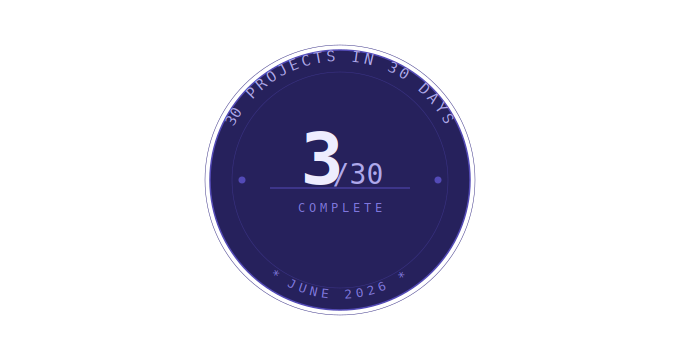

<table><tr>
<td></td>
<td><h1>Day 3/30 — Caesar Cipher</h1></td>
</tr></table>

Today was Game 1 of the Spurs vs Knicks NBA Finals, so I did not do a notable project, instead I focussed on honing in skills before midnight to crunch out Day 3. A Caesar Cipher simply shifts a string of words a certain number of times provided. If my message was "AAA" and I shifted it three times, it becomes "DDD". "ABC" -> "DEF". So on, so forth.

Regardless, it's always a good time to make code more efficient. I know that longer programs are flashy, but I always prefer the most optimal, shortest, yet readable results. So I do anything I can to erase unnecesary code.

When writing this I overestimated how much logic would differentiate between encryption and decryption, so I had this.
```
    int shift = atoi(argv[2]);

    if(!((strcmp(argv[1], "encrypt") == 0)||(strcmp(argv[1], "decrypt") == 0))){
        printf("Only valid instructions are encrypt and decrypt.");
        return 1;
    }

    char *ret = malloc(strlen(argv[3]) + 1); //according to internet i should do this as +1 for null terminator
    strcpy(ret, argv[3]);

    int i = 0;
    if((strcmp(argv[1], "encrypt") == 0)){
        while(ret[i]){
            if(ret[i]>='A'&&ret[i]<='Z'){
                ret[i] = ((ret[i] - 'A' + shift) % 26) + 'A';
            }else if(ret[i]>='a'&&ret[i]<='z'){
                ret[i] = ((ret[i] - 'a' + shift) % 26) + 'a';
            }
            
            i++;
        }
    }else{
        shift = 26 - shift;
        while(ret[i]){
            if(ret[i]>='A'&&ret[i]<='Z'){
                ret[i] = ((ret[i] - 'A' + shift) % 26) + 'A';
            }else if(ret[i]>='a'&&ret[i]<='z'){
                ret[i] = ((ret[i] - 'a' + shift) % 26) + 'a';
            }
            
            i++;
        }
    }

    printf("%s\n",ret);
```

If you can't see it, the logic for shifting is almost identical. The common outlier is how shift is affected. Hence I simplified it to just being an if statement

None of this is groundbreaking or new to me, but I find myself becoming better at C as the days go by. It's a fun programming language, just a slight learning curve if you're not as familiar to working with poitners as I am. As an upcoming Sophmore I do like being ahead of my classmates, so I figured this Summer I should master C before taking the Programming in C course so I can work on skills I need to focus on instead of being caught up in learning a new language at the same time.

Thanks for coming to my TED Talk.